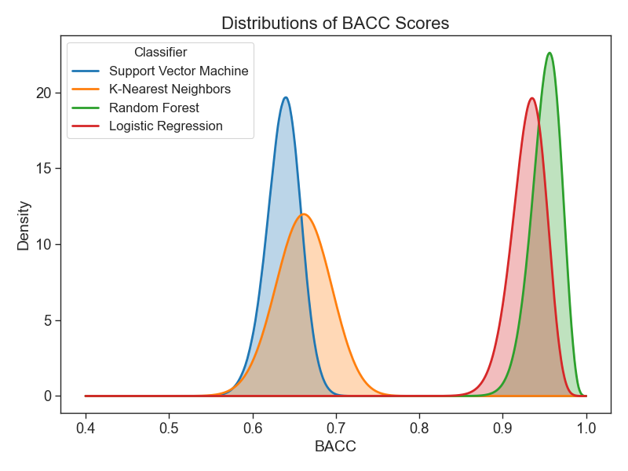
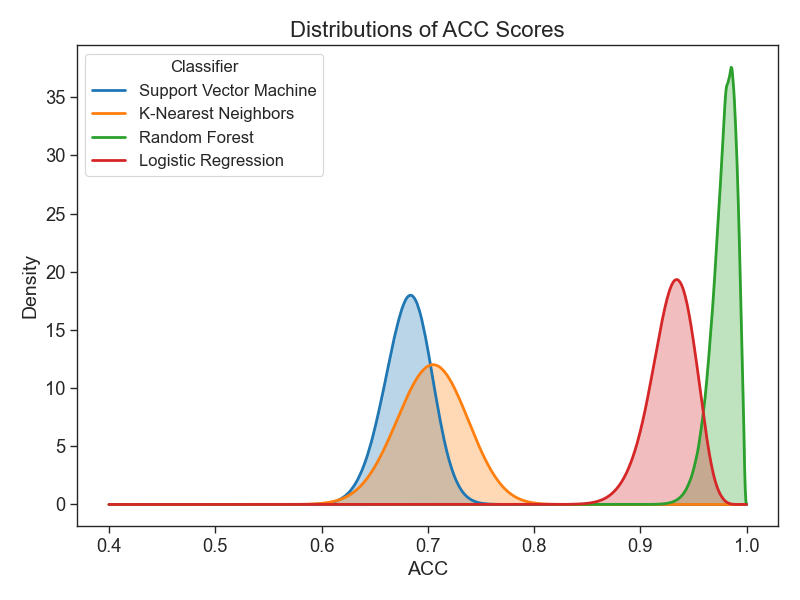
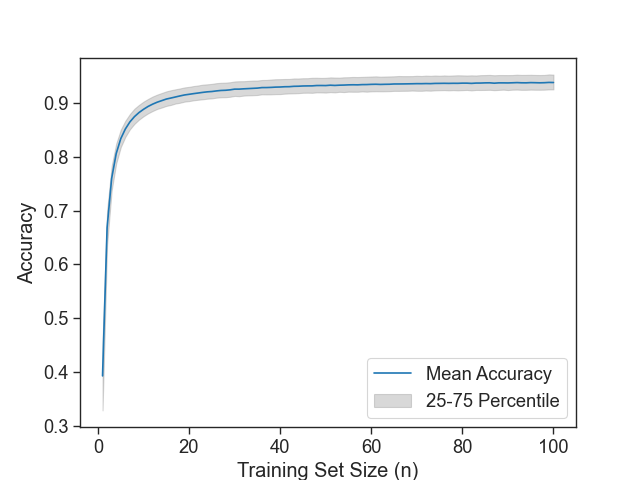

# Introduction

Research in behavioral and social science freuqently uses group comparisons, as evidenced by a plethora of research papers [e.g., @wee_comparison_2000; @weisberg_gender_2011; @zhao_comparison_2020]. 
A variety of statistical tools are available for univariate comparisons, including parametric tests such as z-tests, t-tests, ANOVAs and Levene's test [@pearson1900x; @student1908probable; @fisher1970statistical; @levene1960robust]. 
In fact, in a systematic review of major Canadian psychology journals, Counsell and Harlow [-@counsell_reporting_2017] found that 40% of analyses used simple mean comparisons like ANOVA.
A variety of methods is available for group comparisons for multidimensional purposes. 
However, all of those are predicated on assumptions regarding the model that the data is assumed to follow [@kim_classifiers_2018]. 
In instances where these assumptions are not well-founded, an alternative approach for comparing groups is necessary.

In this context, classifiers [@boucheron_theory_2005; @bay_detecting_2001] have been proposed as a universal non-parametric alternative for group comparisons [@kim_classifiers_2018].
In the domain of machine learning, classifiers are a prevalent instrument for distinguishing between groups.
A variety of classifiers exist, including for example Decision Trees [@breiman_classification_2017], Random Forests [@ho_random_1995], Support Vector Machines [@cortes_support-vector_1995], or K-nearest neighbor [@cover_nearest_1967].
Groups comparisons by classifier is done by training the classifier on the dataset to distinguish the groups. 
If the groups are identical, the classifier will be unable to classify better than by guessing. 
Therefore, if the classifier predicts better than guessing, it can be concluded that there is a group difference.
This procedure makes it necessary to estiamted a classifier's prediction accuracy.
That can be achieved in various ways; typical examples include a train-test split, Cross Validation (CV), or bootstrap [@kohavi_study_1995].

Train-test split works by splitting the data into a train set and a test set. 
The training set is used to train the classifier, which then predicts the elements of the test set [@kohavi_study_1995].
The accuracy is then the number of correct classifications over the total number of classifications, which is binomially distributed and hence allows for all kinds of statistical tests. For instance, a binomial test against a null hypothesis of a guessing classifier can be used to determine if the groups differ significantly in a frequentistic analysis.
However, since the amount of data is limited [@sahiner_classifier_2008], splitting the data reduces the size of both the training set, giving less learning opportunities for the classifier, and the test set, adding more standard error in the binomial test. 
In consequence, this leads to a decline in the accuracy of the model [@santafe_dealing_2015] and a less precise estimate of the accuracy. This also limits the statistical power, which is undesirable [@rossi_statistical_2013].
Consequently, the train-test split is an uncommon method; usually, variants of CV are used instead [@kohavi_study_1995; @devroye_distribution-free_1979; @geisser_predictive_1975; @stone_cross-validatory_1974].

In the CV process, the dataset is split into $k$ subsets called "folds." Then, a procedure analogous to the train-test split is repeated for each fold, in which the classifier is trained on $k-1$ folds and subsequently predicts the items of the remaining fold. In total, every element is tested, so that the testset size equals the size of the full dataset, and the size of the training set is $\frac{k-1}{k}$ times the size of the full dataset. This approach addresses the problem posed by the reduced dataset sizes, thereby eliminating the diminished statistical power inherent to the train-test split method. As the value of $k$ increases, the training set size concomitantly increaes. In the particular case where $k$ is equal to the dataset size, this method is referred to as Leave-One-Out [LOO\; @hastie2009elements], maximizing training- and testset size. 

It is often believed that the accuracy of CV predictions also follows a binomial distribution [@salzberg_comparing_1997].
However, this is incorrect due to the dependency inherent in the repeated training and testing procedure, which results in an increased variance, as conjectured by Bouckaert [-@bouckaert_choosing_2003] and proven by Kim & von Oertzen [-@independent_validation].
This results in alpha inflation of frequentistic tests, as has already been observed by Dietterich [@dietterich_approximate_1998]. It also makes Bayesian estimation of the accuracy impossible. This effect should not be confused with the alpha inflation caused by actual dependency between the samples of the dataset themselves [@kohavi_study_1995]. The alpha inflation in this case is caused by the repeated training and testing progress, which creates dependencies of the probabilities that samples are classified correctly, even if the data samples themselves are independent.
The accuracy distribution of CV is an unknown distribution that depends on the choice of classifier.

One approach to conducting a hypothesis test against the null hypothesis of no difference between the groups is to utilize permutation tests [@pesarin_permutation_2010]. Permutation tests repeatedly estimate the CV accuracy on the dataset while shuffling the group labels. This allows to approximate the distribution of the accuracy under the assumption of no difference between the groups. Comparing the CV accuracy with the original labels to this distribution allows to generate a significance test against the null hypothesis of no group difference. However, permutation tests are computationally expensive, as they have to repeat the CV procedure multiple times. In addition, they can only be used for frequentistic tests against the null hypothesis of no group differences, not for any other significance test (e.g., whether one classifier outperforms another) or any Bayesian analysis. 

Another possibility is to repeatedly sample a training set by bootstrapping and then testing those samples that have not been sampled in the bootstrap [@kohavi_study_1995]. This emulates a Bayesian approach, as it generates a distribution around the point estimate on training set sizes identical to the full dataset size. However, the method introduces a dependency between the training test data samples, as some of those are repeated, which compromises the resulting distribution. In general, the distribution is not the posterior distribution, so that it cannot correctly be used for freuqentistic or Bayesian testing. 

As all of these methods are not suitable for Bayesian estimates and computationally expensive, Independent Validation (IV) method was proposed by Kim and von Oertzen [-@kim_classifiers_2018]. IV uses samples for training exclusively after they have been predicted, ensuring independence between the predictions. In this way, the training set size increase during the validation procedure, and tests on almost all samples of the dataset. This consequently leads to a binomial distribution of the accuracy. With this known distribution of the accuracy, it is possible to perform frequentistic tests against different null hypothesis and, more importantly, Bayesian estimation and testing of the accuracy. 

However, for small datasets IV shows a tendency to underestimate the accuracy, since testing in the first few steps has a small training set size. The issue was addressed by Braun, Eckert, and von Oertzen [@braun_independent_2023] by using an estimate of the asymptotic accuracy as the training set size approaches infinity. This utilizes the fact that IV provides correctness of items on differing training set sizes, which allows to estimate the function mapping training set size to the accuracy distribution.

A preliminary version of this method was implemented in R [@braun_independent_2023; @r_development_core_team._r_2010]. R is a useful tool for statistical computing, with a wide range of statistical libraries and packages. However, R is not explicitly build for machine learning applications, and consequently R isn't widely used in this community. Instead, Mooney [-@kaggle-survey-2022] reports that the by far most common language for machine learning applications is Python [@van_rossum_python_1995]. To make IV commonly available for machine learning community, an implementation in Python is required. In addition, the R implementation of IV does not estimate the asymptotical accuracy in a Bayesian way, which is one of the most important advantages of IV.   

In this article, an implementation of IV in Phython is introduced\footnote{The package can be downloaded at [https://github.com/jonasthedevonoertzen/IV](https://github.com/jonasthedevonoertzen/IV)}. It applies a Bayesian algorithm that can compute the accuracy of the classifier within each class (e.g., the specificity and sensitivity for detecting a depression), on the whole data set, and the Balanced Accuracy (BAC) for a weighted comparison of the class. For each of these accuracies, the posterior distribution can be obtained for the asymptotic accuracy or for every training set size. A small simulation is provided to explain the usage of the package and to demonstrate the results. The article closes by a discussion of the package for the research field. 

# Background and Implementation

## IV Process
To reiterate, Kim and von Oertzen [-@kim_classifiers_2018] showed that independence of the results is ensured if every tested point has not been used for training beforehand. To achieve this, IV starts with a small starting set as the initial training set, tests a batch of points, records the result, and then adds this batch to the training set. The classifier is subsequently retrained on the updated training set. This process continues iteratively until the entire dataset has been used.

In theory, the initial training set size can be zero, which causes the classifier to begin by guessing the class of the first batch of samples before adding it to the training set. However, in practice, the training set is typically initialized with a small number of samples. This is because the first classifications provide no information while still introducing noise. Additionally, some classifiers require a certain minimum number of samples to function; for instance, a $k$-Nearest-Neighbor classifier needs at least $k$ elements in the training set. 

In the current implementation, the default initial training set size is two. For larger datasets, increasing this size to ten or more is recommended. 

After being trained on the current training set, the classifier predicts the next batch of samples. The number of correct classifications in this batch is recorded for each class, along with the corresponding training set size. By defaul, the batch size is set to one. However, for larger datasets increasing the batch size is recommended. Larger batch sizes have minimal effect on the information for large datasets while significantly reducing computational costs.

## Mathematical Model for the Likelihood
In the next step, the recorded training set sizes and corresponding correctness data are used to estimate the parameters of the function that maps training set size to correctness probability. Braun, Eckert and von Oertzen [-@braun_independent_2023] showed that the accuracy within each class can be approximated by:
$$
P(\text{outcome} = 1) = a - \frac{b}{n}
$$ {#eq-likelihood}
where $a$ is the asymptotic accuracy, that is, the theoretical accuracy as \( n \to \infty \), and $b$ is an offset factor that determines the deviation from this asymptote for finite training sample size $n$.

The likelihood for a correct classification at any value of $(a,b)$ is given by [@eq-likelihood], while the likelihood of a misclassification is one minus this value. The overall likelihood of the complete set of classification results is the product of the likelihoods for each classification result. To prevent numerical issues, the current implementation uses the log likelihood. 

## Monte Carlo Markov Chains
A Monte Carlo Markov Chain (MCMC; [@metropolis1953equation]) is then used to sample from the posterior distribution of $a$ and $b$. A uniform prior between 0 and 1 is used for $a$, and a flat prior on the positive numbers for $b$. The MCMC implemented here is a Metropolis Hastings algorithm, chosen for its computational  efficiency and robustness [@hastings1970monte]. 

The MCMC can be initialized with various parameters, including burn-in size (default 100), thinning (default 50), target number of samples (default 1000), and step size for the next proposed candidate (default $0.1$ in both directions). Larger burn-in sizes, more samples, and greater thinning will improve sample quality, but at the cost of increased runtime. However, since the MCMC operates on precomputed the classification results, computational costs remain manageable even with large number of samples. 

The MCMC is performed separately for each class to obtain the posterior distribution for $a$ and $b$, where  $a$ represent the asymptotical accuracy in that class, i.e., the accuracy the classifier would reach for an infinite amount of training data. 

## Output of the Analysis
The user of the package can access the distribution of $a$ for each class directly as a list of samples. Additionally, they can request specific metrics, such as the MAP accuracy for that class, the posterior mean, the standard deviation, the probability of exceeding a certain threshold (i.e., the cumulative distribution function), or the probability that the asymptotic accuracy exceeds the asymptotic accuracy of a second distribution (e.g., a different classifier that the user wishes to compare against).

In addition to the within-class accuracy, the package provides the accuracy and BAC for the entire dataset, as well as any other weighted combination of class accuracies. These metrics are computed as a weighted sum of the individual class accuracies. In the case of the BAC, all classes are weighted equally, yielding an accuracy index that is independent of the class sizes in the dataset.

The combined class accuracies are computed by first multiplying the random variable for each class by its corresponding weight, then convolving the distributions to obtain the distribution for the weighted sum.

The package also combines the posteriors of $a$ and $b$ to provide a distribution of the expected accuracy for any finite sample size. Similar to the asymptotic accuracies, the expected accuracy for each class, for the entire dataset, or the expected BAC for the entire dataset can be accessed. Using the same methods as described above, the package provides metrics such as the MAP, mean, standard deviation, or any cumulative probability of the probability distributions. 

# Illustrative Example

## Is There a Group Difference?

Assume a researcher, let’s call her Annabelle, wants to find out if there is a difference between three types of wine called Barolo, Lugana, and Primitivo\footnote{The different types of wine could represent different treatment groups in a psychological experiment, different gender identities in a social science study, or different conditions in a neurological study.}.

Her dataset consists of the chemical features for 59 different Barolo, 71 Lugana, and 48 Primitivo wines\footnote{The dataset for this example is available at [archive.ics.uci.edu](https://archive.ics.uci.edu/dataset/109/wine) [@aeberhard1994comparative]. The Python code for the examples presented here can be found at [https://github.com/HannesDiemerling/IV-Implementation/tree/main](https://github.com/HannesDiemerling/IV-Implementation/tree/main)}.
Assuming all three types of wine are indistinguishable with respect to the chemical features under investigation, no classifier would be able to perform better than guessing, which corresponds to a BAC of $\frac{1}{3}$.
Annabelle’s research hypothesis, in terms of the BAC, is whether the BAC is above $\frac{1}{3}$ for a classifier that asymptotically should be able to detect the difference.

She chooses a Support Vector Machine (SVM) as her classifier, imports the IV package, and initializes the IV object with this classifier and her dataset.
Then, she selects an initial training set size of five and the default batch size of one since her data set is relatively small.

With this setup, she runs the IV process.
She then starts the estimation process to obtain the posterior distribution for $a$ and $b$.
Using a burn-in phase of 1500 samples, a thinning factor of 10, and the default step size of 0.2, she generates 1000 samples from the posterior.
Annabelle can now extract various numerical values and distributions from this object, @fig-svmclassifier shows the corresponding plot.
To investigate whether the model can predict the different wines, she calculates the posterior probability, assuming a flat prior, that the BAC exceeds $\frac{1}{3}$. She finds that, within the limits of machine precision, the probability that the BAC is less than or equal to $\frac{1}{3}$ is effectively zero.

{#fig-svmclassifier}

She extracts the MAP of the distribution from the IV object, obtaining MAP = 65.46% with a 95% CI of [58.1%, 72,1%].
To further illustrate the results, Annabelle uses the plot parameter of the distribution function to visualize the BAC.
Since the distribution is precomputed, the function immediately generates the plot, allowing her to visually inspect the distribution around the MAP.
The lower bound of the CI is at 58.1%, the guessing threshold of $\frac{1}{3}$ is not within that interval. This confirms that the prediction is better than chance. 
Based on these findings, she concludes that there are identifiable differences among the types of wine and that the model is capable of distinguishing between them.

She is now interested in determining whether two of her wine types, Barolo and Lugana, differ substantially in their chemical composition.
To investigate this, she selects a subset of her dataset containing only these two wines.
She then creates a new IV object and runs the compute posterior method using the same default parameters as before, still using the SVM to distinguish between Barolo and Lugana.
She is interested in the performance in terms of sensitivity and specificity of detecting Barolo wine\footnote{Again, this could also be the sensitivity and specificity of screening tool in clinical psychology}.  
She accesses those in the IV class by specifying the two wine labels in the accuracy method.
The sensitivity, which reflects how well the model successfully identifies Barolo wines, is 76.92%. The specificity, i.e., the number of correct classifications of the other wine type, Lugana, is reported as 98.07%.
The result suggest that although the classifier performs well overall, its ability to distinguish Barolo is lower than its ability to identify Lugana.
Encouraged by these insights, Annabelle now turns her attention to a broader question: could another classifier perform even better?

## Which Classifier is Best?

Annabelle has already found a model that can distinguish between the wines, but she is not satisfied and wants to know if there is a better model available.
She creates three more IV objects using the classifiers $k$-Nearest Neighbor (kNN), Random Forest (RF), and Logistic Regression (LR).
She then runs the IV and computes the posterior for each.
To compare the different classifiers, she decides to evaluate them based on their BAC distributions, with higher values being better.
@fig-comparison shows the plotted distributions.
As can be seen, the SVM and the kNN perform noticeably worse than the LR and the RF.
The RF shows the best performance with a MAP of 95.64%, which is nearly perfect for our data.
The LR has a MAP of 93.53% and thus a very similar. Annabelle therefore is curious with what probability the RF outperforms the LR.
Fortunately, a service function tests whether one random variable is greater than another, resulting in a probability of 77.59% for the hpyothesis that the RF outperforms the LR on a latent level.
Annabelle is amazed by this and changes her model to the RF, now having a model that improves her ability to determine the wine type based on its chemical ingredients.

{#fig-comparison}

## Which Classifier has the Best Global Accuracy?

A friend of Annabelle wants to create a tool that can predict the type of wine based on its chemical ingredients.
He is paid per correctly classified wine, so he is not interested in the BAC but in the global accuracy, which is the percentage of wines correctly classified.
Annabelle now wants to plot the accuracy distributions of her classifiers to find the best option for her friend. @fig-ACCcomparison shows the plot, and again the RF performs best with a MAP of 98.58% while the probability that it outperforms the LR is 98.38%.
Therefore, she clearly recommends the RF to her friend.

{#fig-ACCcomparison}

## What is the Expected Accuracy for Finite Sample Sizes?

However, Annabelle’s friend still has another task for her.
To reduce costs, he wants to use as few wines as possible for training, and asks Annabelle if she can advise him on this.
She investigates the impact of an increasing training set size on the expected accuracy by examining the development of the accuracy with respect to the training size.
The IV object generates this posterior distribution for each possible test set size, and generates a plot showing the mean along with the first and third quartiles for every training set size from 1 to 100, which is the default value.
This results in Figure @fig-development, which she sends to her friend.
He looks at the plot and determines that the first 20 samples are the most impactful, so he will purchase only 20 samples to save money.

{#fig-development}

# Discussion
IV is a method for evaluating classifier accuracy based on known data likelihood. Existing implementations are limited to R and are not widely available as packages (e.g., on CRAN; [@braun_independent_2023]). This article introduces a Python package, integrated with the scikit-learn library, which is currently the most widely used programming language in machine learning. The package employs a Metropolis-Hastings MCMC algorithm to estimate the posterior probability of classifier accuracy within each class and aggregates these estimates into multiple relevant metrics and distributions. An empirical example using the Wine dataset [@aeberhard1994comparative] demonstrates the package’s functionality and output.  

## Interpretations
To the best of the authors’ knowledge, no other implementation exists that computes the Bayesian posterior of a classifier’s asymptotic within-class accuracy. Existing methods that approximate at least frequentist baseline distributions for a purely guessing classifier have significant drawbacks: some are computationally expensive (e.g., permutation tests), other reduce available data (e.g., training-testset-separation), and some do not work correctly to begin with (e.g., CV using a binomial null distribution). Moreover, none of these methods allow a comparisons beyond anything but chance performance or support a Bayesian approach. 

The Bayesian distributions of the asymptotic within-class accuracy serve as the foundation for computing the posterior of key indices describing classifier performance. They also enable Bayesian inference on empirical hypotheses, such as whether two groups differ or one classifier outperforms another. 

These indices include the classifier’s specificity and sensitive (i.e., within-class accuracy for two classes), the asymptotic total classifier accuracy, the asymptotic balanced accuracy, and any other weighted sum of class accuracies. For all of these performance measures, the research can also use the package to compute the expectation for a final training set size (again represented as a Bayesian posterior). Each posterior distribution can be accessed either through the full set of samples or via summary descriptors, including the Maximum A-Posteriori (MAP), mean, standard deviation, credible intervals and percentile intervals of any size, and specific probabilities for defined thresholds. For example, researchers can determine the probability that the classifier performs better than chance or better than a chosen performance threshold. 

Using these capabilities, the package enables researchers in the behavioral sciences to address various common research questions. For example, if a clinical research wants to use a classifier – such as a threshold on a sum score - as screening tool for a psychological disorder, the package provides Bayesian estimates of the sensitivity and specificity or the test. This allows to test hypotheses about these, such as whether the sensitivity exceeds 90 percent. The test can be done by accessing the posterior probability for this event from the within-class accuracy of the classifier among patients with the disorder. 

Similarly, a sociologist may want to examine whether individuals with low socio-economic status (SES) perform differently from those with high SES on a diverse set of cognitive tasks that cannot be easily combined into a single score. By training a classifier on the two groups, they can use the Bayesian posterior of balanced accuracy (BAC) to determine the probability that the classifier performs better than chance, providing evidence of a meaningful group difference. 

Analogously, a neurologist might investigate whether brain activities differs between two experimental conditions. Again, by training a classifier on imaging data, they can use the package to obtain a Bayesian posterior probability that the classification performance exceeds guessing. 

Finally, an expert in machine learning may be interested in comparing a newly developed classifier to an existing one on a benchmark dataset. The package allows them to obtain the posterior distributions of both classifiers and visualize the posterior probability that one outperforms the other in terms of accuracy, BAC, or any other weighted accuracy measure. 	

## Limitations
A limitation of IV is that the assumed functional form mapping training set size to classifier performance within a group is a good approximation for training set sizes around ten samples but less accurate on very low sample sizes. Additionally, testing is not entirely independent when sample sizes are very low, as missclassified items added to the training set can bias subsequent classifications. Overly small starting sets may lead to Haywood cases in the Bayesian estimation. 

However, for moderate samples sizes, this issue largely disappears, as the initial training set size can be made sufficiently large. For small datasets, though, this approach results in some data loss, albeit less than in methods like train-test-splitting. To mitigate this effect for small N, the Python package introduced constraints the minimal expected success rate probability to the guessing probability. While this improves the approximation, it does not fully resolve the issue. Therefore, whenever possible, users are advised to use sufficiently large initial test sets. 

The batch size used to add items to the training set in IV involves a tradeoff. From an estimation perspective, a batch size of one is optimal. However, for large datasets with thousands of samples, this approach is computationally expensive. However, for such large datasets using larger batch sizes - in the order of magnitude of one tenth of the total dataset - results only in negligible loss of information, while significantly accelerating processing. 

## Future Directions and Conclusions
A promising future direction in this line of research is to mathematically investigate whether an improved model for expected accuracy at very low training set sizes can be developed, and possibly integrated with the existing model, which performs well for moderate sample sizes. 

Another open question is to what extent IV can be applied to evaluate machine learning regression results or in the context of Large Language Models [@touvron_llama:_2023]. Similar to categorical classification, CV is commonly employed to assess regression performance, with various suggestions for loss functions [@picard_cross-validation_1984]. Accurately quantifying uncertainty in loss may require an independent validation technique analogous to the one proposed here for categorical classification. 

Independent validation is the preferred method for optimizing statistically accurate accuracy estimation. With the Python implementation introduced here, it can now be seamlessly integrated with classifiers in empirical research. This will help researchers in mostly all empirical research fields to improve their research and strengthen progress of science. 

# References

::: {#refs}
:::

