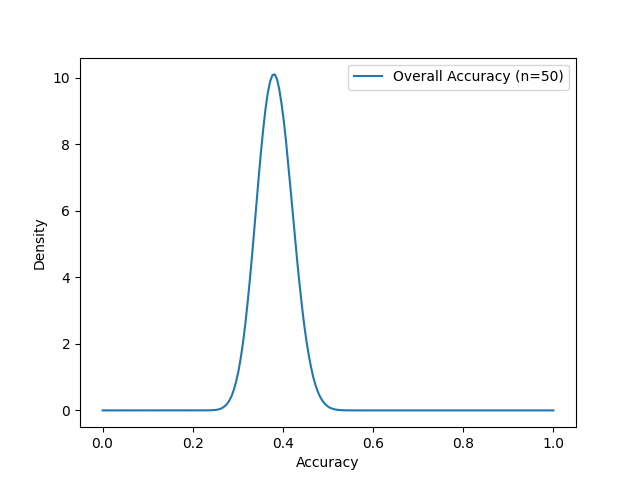

# Introduction

Research in behavioral and social science freuqently uses group comparisons, as evidenced by a plethora of research papers [e.g., @wee_comparison_2000; @weisberg_gender_2011; @zhao_comparison_2020]. 
A variety of statistical tools are available for univariate comparisons, including parametric tests such as z-tests, t-tests, ANOVAs and Levene's test [@pearson1900x; @student1908probable; @fisher1970statistical; @levene1960robust]. 
In fact, in a systematic review of major Canadian psychology journals, Counsell and Harlow [-@counsell_reporting_2017] found that 40% of analyses used simple mean comparisons like ANOVA.
A variety of methods is available for group comparisons for multidimensional purposes. 
However, all of those are predicated on assumptions regarding the model that the data is assumed to follow [@kim_classifiers_2018]. 
In instances where these assumptions are not well-founded, an alternative approach for comparing groups is necessary.

In this context, classifiers [@boucheron_theory_2005; @bay_detecting_2001] have been proposed as a universal non-parametric alternative for group comparisons [@kim_classifiers_2018].
In the domain of machine learning, classifiers are a prevalent instrument for distinguishing between groups.
A variety of classifiers exist, including for example Decision Trees [@breiman_classification_2017], Random Forests [@ho_random_1995], Support Vector Machines [@cortes_support-vector_1995], or K-nearest neighbor [@cover_nearest_1967].
Groups comparisons by classifier is done by training the classifier on the data set to distinguish the groups. 
If the groups are identical, the classifier will be unable to classify better than by guessing. 
Therefore, if the classifier predicts better than guessing, it can be concluded that there is a group difference.
This procedure makes it necessary to estiamted a classifier's prediction accuracy.
That can be achieved in various ways; typical examples include a train-test split, cross-validation, or bootstrap [@kohavi_study_1995].

Train-test split works by splitting the data into a train set and a test set. 
The training set is used to train the classifier, which then predicts the elements of the test set [@kohavi_study_1995].
The accuracy is then the number of correct classifications over the total number of classifications, which is binomially distributed and hence allows for all kinds of statistical tests. For instance, a binomial test against a null hypothesis of a guessing classifier can be used to determine if the groups differ significantly in a frequentistic analysis.
However, since the amount of data is limited [@sahiner_classifier_2008], splitting the data reduces the size of both the training set, giving less learning opportunities for the classifier, and the test set, adding more standard error in the binomial test. 
In consequence, this leads to a decline in the accuracy of the model [@santafe_dealing_2015] and a less precise estimate of the accuracy. This also limits the statistical power, which is undesirable [@rossi_statistical_2013].
Consequently, the train-test split is an uncommon method; usually, variants of cross validation (CV) is used instead [@kohavi_study_1995; @devroye_distribution-free_1979; @geisser_predictive_1975; @stone_cross-validatory_1974].

In the process of cross-validation, the dataset is split into $k$ subsets called "folds." Then, a procedure analogous to the train-test split is repeated for each fold, in which the classifier is trained on $k-1$ folds and subsequently predicts the items of the remaining fold. In total, every element is tested, so that the testset size equals the size of the full dataset, and the size of the training set is $\frac{k-1}{k}$ times the size of the full dataset. This approach addresses the problem posed by the reduced dataset sizes, thereby eliminating the diminished statistical power inherent to the train-test split method. As the value of $k$ increases, the training set size concomitantly increaes. In the particular case where $k$ is equal to the dataset size, this method is referred to as Leave-One-Out (LOO) [@misc{hastie2009elements], maximizing training- and testset size. 

It is often believed that the accuracy of CV predictions also follows a binomial distribution [@salzberg_comparing_1997].
However, this is incorrect due to the dependency inherent in the repeated training and testing procedure, which results in an increased variance, as conjectured by Bouckaert [-@bouckaert_choosing_2003] and proven by Kim & von Oertzen [-@independent_validation].
This results in alpha inflation of frequentistic tests, as has already been observed by Dietterich [@dietterich_approximate_1998]. It also makes Bayesian estimation of the accuracy impossible. This effect should not be confused with the alpha inflation caused by actual dependency between the samples of the data set themselves [@kohavi_study_1995]. The alpha inflation in this case is caused by the repeated training and testing progress, which creates dependencies of the probabilities that samples are classified correctly, even if the data samples themselves are independent.
The accuracy distribution of CV is an unknown distribution that depends on the choice of classifier.

One approach to conducting a hypothesis test against the null hypothesis of no difference between the groups is to utilize permutation tests [@pesarin_permutation_2010]. Permutation tests repeatedly estimate the cross validation accuracy on the dataset while shuffling the group labels. This allows to approximate the distribution of the accuracy under the assumption of no difference between the groups. Comparing the CV accuracy with the original labels to this distribution allows to generate a significance test against the null hypothesis of no group difference. However, permutation tests are computationally expensive, as they have to repeat the CV procedure multiple times. In addition, they can only be used for frequentistic tests against the null hypothesis of no group differences, not for any other significance test (e.g., whether one classifier outperforms another) or any Bayesian analysis. 

An alternative is to repeatedly sample a training set by bootstrapping and then testing those samples that have not been sampled in the bootstrap [@kohavi_study_1995]. This emulates a Bayesian approach, as it generates a distribution around the point estimate on training set sizes identical to the full data set size. However, the method introduces a dependency between the training test data samples, as some of those are repeated, which compromises the resulting distribution. In general, the distribution is not the posterior distribution, so that it cannot correctly be used for freuqentistic or Bayesian testing. 

An alternative validation called Independent Validation (IV) method was proposed by Kim and von Oertzen. This method uses samples for training exclusively after they have been predicted, ensuring independence between the predictions. In this way, the training set size increase during the validation procedure, and tests on almost all samples of the data set. This consequently leads to a binomial distribution of the accuracy [@kim_classifiers_2018]. With this known distribution of the accuracy, it is possible to perform frequentistic tests against different null hypothesis and, more importantly, Bayesian estimation and testing of the accuracy. 

However, for small data sets IV shows a tendency to underestimated the accuracy, since testing in the first few steps has small training set size. The issue was addressed by Braun, Eckert, and von Oertzen [@braun_independent_2023] by using a estimate of the asymptotic accuracy as the training set size approaches infinity. This utilizes the fact that IV provides correctness of items on differing training set sizes, which allows to estimate the function mapping training set size to the accuracy distribution.

The implementation of this method was done in R [@kim_classifiers_2018; @braun_independent_2023; @r_development_core_team._r_2010]. R is a useful tool for statistical computing, with a wide range of statistical libraries and packages. However, R is not explicitly build for machine learning applications, and consequently this community does not use R frequently. Instead, the by far most common language for machine learning applications is Pyhthon [@kaggle-survey-2022]. To make IV commonly available for machine learning community, an implementation in Python is required. In addition, the R implementation of IV does not estimates the asymptotical accuracy in a Bayesian way, which is one of the most important advantages of IV.   

In this article, an implementation of IV in Phython is introduced. A similar approach has been previously reported by [@diemerling2024implementing], who implemented IV for the evaluation of neural networks in Python. Building on this earlier work, the current study focuses on developing a flexible and comprehensive package designed to bring IV to machine learning classification tasks, focusing on classifiers from the sklearn library. It applies a Bayesian algorithm that can compute the accuracy of the classifier within each class (e.g., the specificity and sensitivity for detecting a depression), on the whole data set, and the Balanced Accuracy (BAC) for a weighted comparison of the class. For each of these accuracies, the posterior distribution can be obtained for the asymptotic accuarcy or for every training set size. A small simulation is provided to explain the usage of the package and to demonstrate the results. The article closes by a discussion of the package for the research field. 

---

# IV Process Description

To reiterate, Kim and von Oertzen showed that independence of the results is guaranteed if every tested point hasn't been used for training before. To achieve this IV starts by using a small starting set for training, tests a point (XXX Batch) and records the result and then adds this point to the trainset. The classifier is retrained on the new trainset and this process is repeated until the full dataset is used. 

## predicting samples

The startsize for the trainset can theoretically be zero, in this case the classifier starts by guessing the first sample. Then it would train on the very small trainset of a single sample and logically choose the same label for the second sample. In Practice it is not useful to start with a startset size of 0 for multiple reasons. The information gained on the first sample is zero and on the second sample only an information about the amounts of the different labels. This is because the chance to classify the first sample correctly is 1/amount of labels and the probability to predict the second is the probability for both samples to have the same label. Therefore the information whether the first two samples are predicted correctly or not is not dependent on the realtion between features and labels and therefore not that interesting. 
Another reason why starting with a trainset size of zero is the practical problem that some classifiers need a certain minimum amount of samples to work. An example is the K-nearest Neighbor classifier that predicts a new sample by taking a majority voting of the k nearest neighbors. Logically a trainset would have to have at least k samples (and if it had exactly k samples a new sample would have exactly these k samples as nearest neighbors, so the classification would be independent from the features of the new sample). 
<!-- Also the formular doesn't work for n=0 wegen zero division. -->
In this implementation the default value for the startsize of the trainset is 2, this is also a good value for most cases, if data is plenty, increasing the start trainset size to 10 makes sense, as early values are often less stable. 

As a first step in IV the classifier is trained on the starting trainset being a subset of the full datset. Then this classifier predicts a batch of samples. For each sample in that batch it is recorded whether that sample was classified correctly and on which trainset size the classifier was currently trained (which would be the same value for all samples of the same batch). Then this batch is added to the trainset and the classifier is retrained. Therfore the classifier gets retrained batch size / dataset size - trainset start size times. For a small batch size and a big dataset this can be computationally intensive. For big datasets a batch size of about a fifth of the dataset size works fine. For small datasets the default and minimum value of 1 leads to the best estimation of the asymptotical accuracy, though the difference is minimal. A batch size higher than a third of the dataset is not recommended.

## computing posterior

The accuracy with which a sample is classified correctly increases with the increasing training set. Braun, Eckert and von Oertzen [@braun_independent_2023] found that the accuracy in dependence of the trainset size can be modeled witht his function:
$$
p_n(outcome=1) = \text{asymptote} - \frac{\text{offset\_factor}}{n}
$$
Where the *asymptote* represents the classifier’s theoretical accuracy as \( n \to \infty \), and the *offset factor* controls the decline from the asymptote for finite \( n \).
Both are parameters dependend on the dataset and classifier and can be estimated with bayesian parameter estimation. The Prior for the bayesian estimation is uniform between 0 and 1 for the asymptote and uniform positive for the offset factor. Then the likelihood for any possible combination of asymptote and offset_factor can be computed by using the above formular for every prediction recorded in the prior step. For a successfully predicted sample the likelihood for asymptote and offset_factor is 
$$
\text{Likelihood} = p_n(outcome=1) = \text{asymptote} - \frac{\text{offset\_factor}}{n}
$$
and for an unsuccessfully predicted sample it is 1 minus that. Therefore the full likelihood formular comes out to be:
$$
Likelihood = outcome*p_n(outcome=1) + (1 - outcome) * (1 - p_n(outcome=1))
$$
Multiplying this for every recorded prediction gives the likelihood for the pair of asymptote and likelihood. 
Practically in the implementation instead the logarithm for each is taken and then these are summed up to be the logarithmic likelihood. This improves numerical stability and speeds up the process.

Prior times likelihood gives a distribution that looks like the posterior distribution but has an area that is not equal to one. To get the actual posterior distribution one could compute the integral of this distribution and divide by it. This would normalize the area to one. An alternative option is to use a marcov chain monte carlo (MCMC) which makes it possible to sample from the actual posterior distribution based on the prior and likelihood. The MCMC implemented in this paper uses the metropolis hastings algorithm. This has the advantage of being computationally more efficient and more robust. Also having the posterior distribution as a set of samples allows for manipulations that would require the extra step of sampling if the numerical variant was used instead of MCMC. MCMC takes some parameters that can be specified when called.

## Output

This whole process of computing the posterior is done seperately for each class. For each class the distribution of the asymptote parameter can be returned. This represents the asymptotical accuracy that the classfier would reach for an infinite amount of data. In addition to the accuracy for each class also the accuracy for the whole dataset can be generated. In this case a distinction needs to be made between the accuracy and the balanced accuracy. For the normal accuracy the classes are (usually implicitly) weighted by their frequency in the dataset. The balanced accuracy weights the classes all equally independent from their frequency. Either way all weights add up to one. Both, balanced and normal accuracy are achieved by first multiplying the random variable for each class with its weight. Then the new distributions are convolved giving the final distribution for balanced or normal accuracy.

Alternatively to using the asymptotical accuracy, it is also possible to obtain a posterior distribution for any trainingset size. For a trainingset size n this is acheived by going through the samples of asymptote and offset factor of the posterior distribution and computing p_n for each. This gives then many samples for p_n making together the posterior distribution. Doing this for each label gives multiple accuracy distributions that can be combined the same way as in the asymptotical case to achieve normal or balanced global accuracy. 

## XXX

### Is there a group difference
Assume somebody, lets call her Annabelle, want to find out if there is a difference between two groups. Annabelle uses a Support Vector Machine classifier and IV to get the accuracy of the classifier. To find if there is at all any difference between the groups the question she asks is: How high is the probability that the classifiers asymptotic accuracy is higher or equal to guessing? For a balanced dataset guessing would have an accuracy of 50%. As Annabelle is interested in finding if there is a group difference at all she can use the asymptotic accuracy the SVM would have for infinite data from the groups. The distribution for the (global) asymptotic accuracy is a result of the IV (since the dataset is balanced, balanced and normal global accuracy are identical). Then the hypothesis of no group difference can be rejected with a significance niveau of the integral of 0 to 0.5 of the accuracy distribution. 

### Comparing classifers
Lets say Annabelle found that there is a strong difference between the groups. Now she wants to build a classifier for inference but she is unsure what kind of classifer she should use. 
Her final choice will be trained on a dataset of 25 samples, this is the trainset size for which she wants to optimize the accuracy. Annabelle runs iv with multiple classifers like K-Nearest Neighbor, Random Forest and Linear Regression. As an output she generates the distribution for the global accuracy for a trainset size of 25. For the SVM she does not need to rerun the IV but can simply compute the distribution for global accuracy of 25. Now she has 4 different distributions for the accuracy and can see not only which has the highest MAP or mean but also how much the areas overlap giving her the information that most of these classifers are very similarly good. 

### 

# Results

## Synthetic data

To estimate the quality of a KNN classifier run on some synthetic data. For the data the features are normally distributed with different means and standard deviations for the different groups. The data consists of three different groups that are not balanced. 

TODO: Add Details about data and classifier. 

And now the improved variant. Though this needs to be rechecked whether this is realistic.

If you are really interested in the development these metrics over increasing sample size you can plot this as well.

## The Titanic

The tragic sinking of the Titanic in 1912, which claimed the lives of over 1,500 passengers and crew, remains one of the most infamous maritime disasters in history; through the lens of modern data analysis, this historical event provides a unique opportunity to classify and predict survival outcomes based on passenger demographics and circumstances.

Is it just random chance who survived and who didn't? Or is it dependent on some of the features recorded in this dataset?
If the classifier is capable of predicting the outcomes of the passengers significantly better than chance there must be a difference between the group that the classifier detects.

For this it is interesting if the classifier would be capable of finding a difference when trained on infinite amounts of data. Therefore we observe the asymptotical accuracy. 

Alternatively if we want to use it for inference to predict if somebody on board the titanic is going to drown and we want to know how accurate our own predictions are, we can observe the accuracy for a training set of the size of our actual training set.

Or lets assume we have different classification algorithms and want to find out which is best for our scenario. In that case it would be interesting to look at the development of the accuracy over sample size because some classifiers perform better for small sample sizes but scale less than other classifiers which then outperform the first ones as soon as a certain threshold is reached.

TODO: Can this work in accordance with the assumed formular? Or does the formular imply that all classifiers scale similarly? I fear its the latter. 

# Next chapter

1. **Initialization:**  
    A portion of the available data (the amount is user-definable) is used to train a classifier instance. This initial training set must be smaller than the complete dataset.

2. **Prediction & Recording:**  
    - The remaining dataset is split up in batches, smallest batch size must be one.  
    - For each batch, the classifier makes predictions on the unseen samples.
    - For every sample in the batch, the outcome (1 for a correct prediction or 0 for an incorrect one) is recorded along with the current training set size.

3. **IV Iteration:**  
    Step 2 is repeated until all samples are processed.

4. **Posterior Distribution Computation:**
    The probability to classify a new sample correctly for a given training set size \( n \) is modeled as:
    
    $$
    p_n(outcome=1) = \text{asymptote} - \frac{\text{offset\_factor}}{n}
    $$
     
    Here, the *asymptote* represents the classifier’s theoretical accuracy as \( n \to \infty \), and the *offset factor* controls the decline from the asymptote for finite \( n \).  
    Using the Metropolis-Hastings algorithm (an MCMC sampler), we compute the posterior distribution for these model parameters. This posterior is computed separately for each class (label) in the dataset, enabling both class-specific accuracy assessments and aggregated metrics.

5. **Outputs:**
    The IV process produces several types of outputs:
    - **Accuracy Distribution for an Infinite Training Set**  
      For an infinitely large dataset, the classifier’s expected accuracy is represented by the posterior distribution of the *asymptote* parameter, which is provided for each label by IV.
    - **Finite Training Set Accuracy Distribution:**  
    For a finite training set of size 𝑛, IV can compute the corresponding accuracy distribution. For each MCMC sample, the accuracy at size 𝑛 is determined using:
      $$
      p_n = \text{asymptote} - \frac{\text{offset\_factor}}{n},
      $$  
      All MCMC values together form a distribution for the accuracy at this particular n.
    - **Overall Accuracy Distributions:**  
      Instead of assessing accuracy Distributions for a single label, IV also allows evaluation of the classifier’s performance over the full dataset. Two metrics are available:
      - **Balanced Accuracy (bacc):**  
        Using the IV, it is also possible to get a distribution for the balanced accuracy by convolving the distributions of accuracy per label with equal weights. 
      - **Standard Accuracy (acc):**  
        The accuracy is computed by convolving the per-label distributions with weights proportional to the frequency of each label in the dataset.
    - **Development over Trainingset size:**
      Another alternative is to observe the development of the accuracy while the trainingset increases and therefore the classifier improves. To do so, one of the prior functions is run multiple times with n values from 1 to 100. TODO: Elaborate

---

## Demo

The implementation is demonstrated through a collection of example scripts (e.g., `demo.py` and `services.py`) which exercise different facets of the IV process:

1. **Artificial Data Validation:**
   - **Binary Data Demo:**  
     A synthetic dataset is generated with 2D features where the binary target is defined by the condition \( X_0 + X_1 > 1 \). A k-Nearest Neighbors (kNN) classifier is used to run the IV process.  
     *Output:*  
     - Mean balanced accuracy is computed via repeated IV calls.
     - The overall accuracy distribution is assessed.
     - A comparison is made by computing the probability that the balanced accuracy exceeds the overall accuracy.
     
   - **Multi-class Data Demo:**  
     An artificial dataset with three classes is processed. The IV class (`IV` in `iv8.py`) is used to log outcomes, compute the posterior using MCMC, and generate distributions for per-label and aggregated accuracies.

   - **Graphical Outputs:**  
     The demo routines create several plots using Matplotlib:
     - **Histogram Plots:**  
       For example, a histogram of MCMC samples (generated in `demo_mcmc()`) is overlaid with the analytic standard normal probability density function.
     - **Development Curves:**  
       Line plots showcase the evolution of accuracy (mean and interquartile ranges) as a function of training set size. These plots help visualize how performance converges to its asymptotic value.
     - **Distribution Plots:**  
       Density curves for balanced accuracy (e.g., saved as `demo/synthetic/bacc50_1`) and overall accuracy are generated.
     
2. **Real Data Validation (Titanic Demo):**  
   The IV process is also demonstrated on a real-world dataset (the Titanic dataset). After necessary pre-processing and encoding, a Logistic Regression classifier is evaluated:
   - The IV process records predictions over increasing training set sizes.
   - Posterior distributions for the classifier’s asymptotic and finite-sample performance are computed.
   - Plots are generated for balanced and overall accuracy distributions as well as for development trends.

*Figure placeholders in the demo include:*
- **Figure 1:** Histogram of MCMC samples vs. the analytical standard normal.
- **Figure 2:** Density plots for balanced accuracy with varying training sizes.
- **Figure 3:** Development curves showing mean accuracy and quartile bounds over increasing training set sizes.

---

## Testing Procedures

Robustness and correctness of the IV implementation are ensured via a comprehensive battery of unit tests that cover:

1. **MCMC Sampling (`mcmc.py`):**  
   - **1D and Multi-dimensional Sampling:** Tests confirm that the Metropolis-Hastings algorithm produces samples with approximately the correct mean and variance (e.g., resembling a standard normal distribution).
   - **Acceptance Rate:** The proportion of accepted proposals is verified to be within sensible bounds.

2. **Weighted Sum Distribution (`weighted_sum_distribution.py`):**  
   - **Normalization:** Tests ensure that the combination of individual probability distributions yields a final density that integrates to one.
   - **Weighting Options:** Both default (uniform) and user-specified weights are tested for consistency.

3. **IV Core Functionalities (`iv8.py` and `services.py`):**  
   - **IV Record Logging:** The `run_iv` method correctly logs training set sizes and prediction outcomes.
   - **Posterior Computation:** The `compute_posterior` method populates the posterior dictionary with valid MCMC samples for each label.
   - **Distribution Retrieval and Caching:** Methods such as `get_label_accuracy`, `get_bacc_dist`, and `get_acc_dist` are tested to return valid frozen distribution objects (e.g., instances of `rv_histogram`), with caching ensuring repeated calls yield consistent results.
   - **Service Interface:** The high-level `independent_validation` function is tested for correct behavior under different parameter settings (e.g., when returning only the mean or the full distribution).

These tests are implemented using Python's `unittest` framework and verify the statistical properties and consistency of the simulation outcomes.

---

## Example

To illustrate the practical application of IV, consider a fictional scenario in biomedical diagnostics.

### Fictional Scenario: Diagnostic Accuracy of a Biomarker

**Objective:**  
Assess the performance of a classifier that predicts the presence of a disease based on a single biomarker.

**Fictional Dataset:**

- **Features (Biomarker Level):**  
  \[
  X = \{0.5,\; 1.2,\; 1.8,\; 2.1,\; 2.5,\; 3.0,\; 3.3,\; 3.8,\; 4.2,\; 4.8\}
  \]
- **Labels (Disease Status):**  
  \[
  y = \{0,\; 0,\; 0,\; 1,\; 0,\; 1,\; 1,\; 1,\; 1,\; 1\}
  \]
  Here, a label of 1 indicates disease presence and 0 indicates absence.

### IV Application

1. **Initialization:**  
   A simple k-Nearest Neighbors classifier is initialized. The first three samples, for instance, \((0.5, 1.2, 1.8)\) (all with label 0), are used to train the classifier initially.

2. **Incremental Prediction & Training:**
   - **Batch Processing:**  
     The next sample, \(2.1\) (with true label 1), is evaluated. Assume the classifier incorrectly predicts 0.  
     The outcome \( (0 \text{, with training set size } 3) \) is recorded.
   - The sample \(2.1\) is then added to the training set and the classifier is retrained.
   - This process continues for the remaining samples, with each prediction’s correctness recorded along with the training size.

3. **Posterior Computation:**  
   After the entire dataset is processed, the IV records (comprising prediction outcomes and the respective training set sizes) are used to compute the posterior distribution of the model parameters via MCMC.  
   - For example, the posterior for label 1 (disease present) might indicate an asymptotic accuracy mean of 0.87 with a credible interval of [0.82, 0.91].

4. **Aggregated Metrics:**  
   - **Balanced Accuracy (bacc):**  
     By convolving the separate per-label accuracy distributions (with equal weight for each class), a balanced accuracy distribution is obtained. Suppose this yields a mean balanced accuracy of 0.84 at a training set size of 50.
   - **Overall Accuracy (acc):**  
     The overall accuracy is determined via a weighted average of the per-label accuracies. This metric can be used to compare the diagnostic performance against a baseline (e.g., chance-level performance).

### Interpretation

- The **posterior distributions** derived from the IV process offer a transparent picture of uncertainty in classifier performance, facilitating rigorous statistical tests (e.g., testing against a null hypothesis of no predictive power).
- **Development curves** (accuracy as a function of training set size) help determine how quickly the classifier's performance converges and whether additional data could significantly improve accuracy.
- The derived plots (similar to those generated in our demos) serve as both a validation tool and a means for comparative analysis in applied research.

---

By combining a rigorous, incremental validation process with robust posterior inference, the described methods enable the practical application of Independent Validation in varied research settings—from artificial simulations to real data scenarios such as biomedical diagnostics.

# Results

## Synthetic data

To estimate the quality of a KNN classifier run on some synthetic data. For the data the features are normally distributed with different means and standard deviations for the different groups. The data consists of three different groups that are not balanced. 

TODO: Add Details about data and classifier. 

And now the improved variant. Though this needs to be rechecked whether this is realistic.

If you are really interested in the development these metrics over increasing sample size you can plot this as well.

## The Titanic

The tragic sinking of the Titanic in 1912, which claimed the lives of over 1,500 passengers and crew, remains one of the most infamous maritime disasters in history; through the lens of modern data analysis, this historical event provides a unique opportunity to classify and predict survival outcomes based on passenger demographics and circumstances.

Is it just random chance who survived and who didn't? Or is it dependent on some of the features recorded in this dataset?
If the classifier is capable of predicting the outcomes of the passengers significantly better than chance there must be a difference between the group that the classifier detects.

For this it is interesting if the classifier would be capable of finding a difference when trained on infinite amounts of data. Therefore we observe the asymptotical accuracy. 

Alternatively if we want to use it for inference to predict if somebody on board the titanic is going to drown and we want to know how accurate our own predictions are, we can observe the accuracy for a training set of the size of our actual training set.

Or lets assume we have different classification algorithms and want to find out which is best for our scenario. In that case it would be interesting to look at the development of the accuracy over sample size because some classifiers perform better for small sample sizes but scale less than other classifiers which then outperform the first ones as soon as a certain threshold is reached.

TODO: Can this work in accordance with the assumed formular? Or does the formular imply that all classifiers scale similarly? I fear its the latter. 

## Random Guesses

If all groups have the same distribution for the features, the results of IV look like this:

# Discussion

## The last paragraph
Independent validation is the method of choice to optimize for statistically accurate results. 
With this Python implementation it can now easily be used in combination with classifiers from the sklearn library. 

# References

::: {#refs}
:::
