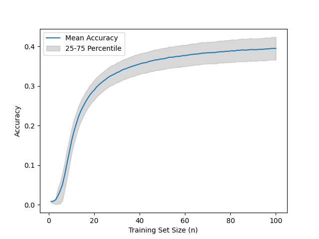

THIS IS ONLY A TEST

# Introduction

Group comparisons are a common task in the social sciences, as evidenced by the plethora of research papers that have been published [@wee_comparison_2000; @weisberg_gender_2011; @zhao_comparison_2020]. 
In a systematic review of major Canadian psychology journals, Counsell and Harlow [-@counsell_reporting_2017] found that 40% of analyses used univariate mean comparison.
In order to compare groups, a variety of statistical tools are available, including parametric tests such as z-tests [@fisher_frequency_1915], t-tests and Levene's test. 
These tests are designed to identify group differences; however, they are predicated on certain assumptions regarding model specifications [@kim_classifiers_2018]. 
In instances where these assumptions are not well-founded, an alternative approach for comparing groups becomes necessary.

In this context, classifiers [@boucheron_theory_2005; @bay_detecting_2001] have been proposed as a non-parametric, universal alternative for group comparisons [@kim_classifiers_2018].
In the domain of machine learning, classifiers are a prevalent instrument for distinguishing between groups.There exists a variety of classifiers, including Decision Trees [@breiman_classification_2017], Random Forests [@ho_random_1995], Support Vector Machines [@cortes_support-vector_1995], and K-nearest neighbor [@cover_nearest_1967].
To compare groups with a classifier the classifier is being trained to distinguish between the groups. Then the classifier attempts to predict group membership for unlabeled samples of data. If the classifier predicts better than guessing it can be concluded that there is a group difference.
The estimation of the classifier's prediction accuracy is, therefore, of relevance [@kohavi_study_1995].
This estimation can be achieved through various ways, like a train-test split, cross-validation, or bootstrap [@kohavi_study_1995].

Train-test split works by splitting the data into a train set and a test set. The training set is then used to train a classifier, which then predicts the test set [@kohavi_study_1995].
The accuracy of the predictions on the test set is binomially distributed, implying that tests can be performed unproblematically. For instance, a hypothesis test against a null hypothesis of a guessing classifier can be used to determine if the groups differ significantly.
However, splitting the data reduces the size of both subsets as the data is usually limited [@sahiner_classifier_2008]. 
This reduction in training data leads to a decline in the accuracy of the model [@santafe_dealing_2015].
Additionally, less testing data leads to a less accurate estimation of the accuracy.
A reduced sample size diminishes statistical power, which is undesirable [@rossi_statistical_2013].
Consequently, the train-test split is an uncommon method; instead, most often cross validation (CV) is used [@kohavi_study_1995; @devroye_distribution-free_1979; @geisser_predictive_1975; @stone_cross-validatory_1974].

<!-- (INCLUDE BOOTSTRAP ?) -->

In the process of cross-validation, the dataset is split into k subsets, or "folds." Then, a procedure analogous to the train-test split is repeated k times. The classifier is trained on a "trainset" consisting of k-1 folds and subsequently predicts the remaining fold. This process is repeated for each fold, resulting in a total testset size equal to the full dataset and a trainset size equal to (k-1)/k times the full dataset. This approach addresses the problem posed by the reduced dataset sizes, thereby eliminating the diminished statistical power inherent to the train-test split method. As the value of k increases, the statistical power of CV concomitantly rises. In the particular case where k is equivalent to the dataset size, this method is referred to as leave-one-out (LOO), a procedure that attains maximum statistical power. 
It is often believed that the accuracy of CV predictions follows a binomial distribution [@salzberg_comparing_1997].
However, this assertion is not accurate due to the dependency inherent in the repeated training and testing procedure, which results in an increased variance, as conjectured by Bouckaert [-@bouckaert_choosing_2003] and proven by Kim & von Oertzen [-@independent_validation].
The phenomenon of Alpha inflation in the context of cross-validation (CV) has been documented by Dietterich [@dietterich_approximate_1998].
In the event that dependencies exist between the samples in the dataset, Alpha inflation is also caused by said dependencies [@kohavi_study_1995]. However, this is a separate problem from the one described herein. The Alpha inflation in this case is caused by the repeated training and testing progress, which creates dependencies of the probabilities that samples are classified correctly.
The accuracy distribution of CV is an unknown distribution that depends on the choice of classifier and dataset.
One approach to conducting a hypothesis test against the null hypothesis of no difference between the groups and, consequently, a guessing classifier is to utilize permutation tests [@pesarin_permutation_2010].Permutation tests identify the distribution of accuracy under the assumption of no difference between the groups, thereby enabling tests to be performed against this assumption as a null hypothesis. 
It is important to note that permutation tests are computationally intensive and can only be used to test against this specific null hypothesis.

An alternative validation method was proposed by Kim and von Oertzen [-@kim_classifiers_2018] called Independent Validation. This method utilizes samples for training exclusively after they have been predicted [@kim_classifiers_2018]. 
This approach ensures independence between the predictions and consequently leads to a binomial distribution of the accuracy [@kim_classifiers_2018].
With a known distribution of the accuracy independent validation enables testing on the accuracy of a classifier.

Independent Validation exhibited a tendency to be biased in cases of small datasets. This issue was addressed by Braun, Eckert, and von Oertzen [@braun_independent_2023] through the development of an estimation for the theoretical accuracy of an infinite dataset (asymptotical accuracy) based on the predictions of the limited dataset. The implementation of independent validation and this estimation method was originally conducted in R [@kim_classifiers_2018; @braun_independent_2023; @r_development_core_team._r_2010]. However, for machine learning, Python is the by far more common language [@kaggle-survey-2022]. This may be part of the reason why Independent Validation is not yet used frequently. 

An implementation of independent validation in Python follows.

# Methods
This section outlines the Independent Validation process and its implementation.

## IV Process Description

The IV process can be divided into the following steps:

1. **Initialization:**  
    A portion of the available data (the amount is user-definable) is used to train a classifier instance. This initial training set must be smaller than the complete dataset.

2. **Prediction & Recording:**  
    - The remaining dataset is split up in batches, smallest batch size must be one.  
    - For each batch, the classifier makes predictions on the unseen samples.
    - For every sample in the batch, the outcome (1 for a correct prediction or 0 for an incorrect one) is recorded along with the current training set size.

3. **IV Iteration:**  
    Step 2 is repeated until all samples are processed.

4. **Posterior Distribution Computation:**
    The probability to classify a new sample correctly for a given training set size \( n \) is modeled as:
    
    $$
    p_n(outcome=1) = \text{asymptote} - \frac{\text{offset\_factor}}{n}
    $$
     
    Here, the *asymptote* represents the classifier’s theoretical accuracy as \( n \to \infty \), and the *offset factor* controls the decline from the asymptote for finite \( n \).  
    Using the Metropolis-Hastings algorithm (an MCMC sampler), we compute the posterior distribution for these model parameters. This posterior is computed separately for each class (label) in the dataset, enabling both class-specific accuracy assessments and aggregated metrics.

5. **Outputs:**
    The IV process produces several types of outputs:
    - **Accuracy Distribution for an Infinite Training Set**  
      For an infinitely large dataset, the classifier’s expected accuracy is represented by the posterior distribution of the *asymptote* parameter, which is provided for each label by IV.
    - **Finite Training Set Accuracy Distribution:**  
    For a finite training set of size 𝑛, IV can compute the corresponding accuracy distribution. For each MCMC sample, the accuracy at size 𝑛 is determined using:
      $$
      p_n = \text{asymptote} - \frac{\text{offset\_factor}}{n},
      $$  
      All MCMC values together form a distribution for the accuracy at this particular n.
    - **Overall Accuracy Distributions:**  
      Instead of assessing accuracy Distributions for a single label, IV also allows evaluation of the classifier’s performance over the full dataset. Two metrics are available:
      - **Balanced Accuracy (bacc):**  
        Using the IV, it is also possible to get a distribution for the balanced accuracy by convolving the distributions of accuracy per label with equal weights. 
      - **Standard Accuracy (acc):**  
        The accuracy is computed by convolving the per-label distributions with weights proportional to the frequency of each label in the dataset.
    - **Development over Trainingset size:**
      Another alternative is to observe the development of the accuracy while the trainingset increases and therefore the classifier improves. To do so, one of the prior functions is run multiple times with n values from 1 to 100. TODO: Elaborate

---

## Demo

The implementation is demonstrated through a collection of example scripts (e.g., `demo.py` and `services.py`) which exercise different facets of the IV process:

1. **Artificial Data Validation:**
   - **Binary Data Demo:**  
     A synthetic dataset is generated with 2D features where the binary target is defined by the condition \( X_0 + X_1 > 1 \). A k-Nearest Neighbors (kNN) classifier is used to run the IV process.  
     *Output:*  
     - Mean balanced accuracy is computed via repeated IV calls.
     - The overall accuracy distribution is assessed.
     - A comparison is made by computing the probability that the balanced accuracy exceeds the overall accuracy.
     
   - **Multi-class Data Demo:**  
     An artificial dataset with three classes is processed. The IV class (`IV` in `iv8.py`) is used to log outcomes, compute the posterior using MCMC, and generate distributions for per-label and aggregated accuracies.

   - **Graphical Outputs:**  
     The demo routines create several plots using Matplotlib:
     - **Histogram Plots:**  
       For example, a histogram of MCMC samples (generated in `demo_mcmc()`) is overlaid with the analytic standard normal probability density function.
     - **Development Curves:**  
       Line plots showcase the evolution of accuracy (mean and interquartile ranges) as a function of training set size. These plots help visualize how performance converges to its asymptotic value.
     - **Distribution Plots:**  
       Density curves for balanced accuracy (e.g., saved as `demo/synthetic/bacc50_1`) and overall accuracy are generated.
     
2. **Real Data Validation (Titanic Demo):**  
   The IV process is also demonstrated on a real-world dataset (the Titanic dataset). After necessary pre-processing and encoding, a Logistic Regression classifier is evaluated:
   - The IV process records predictions over increasing training set sizes.
   - Posterior distributions for the classifier’s asymptotic and finite-sample performance are computed.
   - Plots are generated for balanced and overall accuracy distributions as well as for development trends.

*Figure placeholders in the demo include:*
- **Figure 1:** Histogram of MCMC samples vs. the analytical standard normal.
- **Figure 2:** Density plots for balanced accuracy with varying training sizes.
- **Figure 3:** Development curves showing mean accuracy and quartile bounds over increasing training set sizes.

---

## Testing Procedures

Robustness and correctness of the IV implementation are ensured via a comprehensive battery of unit tests that cover:

1. **MCMC Sampling (`mcmc.py`):**  
   - **1D and Multi-dimensional Sampling:** Tests confirm that the Metropolis-Hastings algorithm produces samples with approximately the correct mean and variance (e.g., resembling a standard normal distribution).
   - **Acceptance Rate:** The proportion of accepted proposals is verified to be within sensible bounds.

2. **Weighted Sum Distribution (`weighted_sum_distribution.py`):**  
   - **Normalization:** Tests ensure that the combination of individual probability distributions yields a final density that integrates to one.
   - **Weighting Options:** Both default (uniform) and user-specified weights are tested for consistency.

3. **IV Core Functionalities (`iv8.py` and `services.py`):**  
   - **IV Record Logging:** The `run_iv` method correctly logs training set sizes and prediction outcomes.
   - **Posterior Computation:** The `compute_posterior` method populates the posterior dictionary with valid MCMC samples for each label.
   - **Distribution Retrieval and Caching:** Methods such as `get_label_accuracy`, `get_bacc_dist`, and `get_acc_dist` are tested to return valid frozen distribution objects (e.g., instances of `rv_histogram`), with caching ensuring repeated calls yield consistent results.
   - **Service Interface:** The high-level `independent_validation` function is tested for correct behavior under different parameter settings (e.g., when returning only the mean or the full distribution).

These tests are implemented using Python's `unittest` framework and verify the statistical properties and consistency of the simulation outcomes.

---

## Example

To illustrate the practical application of IV, consider a fictional scenario in biomedical diagnostics.

### Fictional Scenario: Diagnostic Accuracy of a Biomarker

**Objective:**  
Assess the performance of a classifier that predicts the presence of a disease based on a single biomarker.

**Fictional Dataset:**

- **Features (Biomarker Level):**  
  \[
  X = \{0.5,\; 1.2,\; 1.8,\; 2.1,\; 2.5,\; 3.0,\; 3.3,\; 3.8,\; 4.2,\; 4.8\}
  \]
- **Labels (Disease Status):**  
  \[
  y = \{0,\; 0,\; 0,\; 1,\; 0,\; 1,\; 1,\; 1,\; 1,\; 1\}
  \]
  Here, a label of 1 indicates disease presence and 0 indicates absence.

### IV Application

1. **Initialization:**  
   A simple k-Nearest Neighbors classifier is initialized. The first three samples, for instance, \((0.5, 1.2, 1.8)\) (all with label 0), are used to train the classifier initially.

2. **Incremental Prediction & Training:**
   - **Batch Processing:**  
     The next sample, \(2.1\) (with true label 1), is evaluated. Assume the classifier incorrectly predicts 0.  
     The outcome \( (0 \text{, with training set size } 3) \) is recorded.
   - The sample \(2.1\) is then added to the training set and the classifier is retrained.
   - This process continues for the remaining samples, with each prediction’s correctness recorded along with the training size.

3. **Posterior Computation:**  
   After the entire dataset is processed, the IV records (comprising prediction outcomes and the respective training set sizes) are used to compute the posterior distribution of the model parameters via MCMC.  
   - For example, the posterior for label 1 (disease present) might indicate an asymptotic accuracy mean of 0.87 with a credible interval of [0.82, 0.91].

4. **Aggregated Metrics:**  
   - **Balanced Accuracy (bacc):**  
     By convolving the separate per-label accuracy distributions (with equal weight for each class), a balanced accuracy distribution is obtained. Suppose this yields a mean balanced accuracy of 0.84 at a training set size of 50.
   - **Overall Accuracy (acc):**  
     The overall accuracy is determined via a weighted average of the per-label accuracies. This metric can be used to compare the diagnostic performance against a baseline (e.g., chance-level performance).

### Interpretation

- The **posterior distributions** derived from the IV process offer a transparent picture of uncertainty in classifier performance, facilitating rigorous statistical tests (e.g., testing against a null hypothesis of no predictive power).
- **Development curves** (accuracy as a function of training set size) help determine how quickly the classifier's performance converges and whether additional data could significantly improve accuracy.
- The derived plots (similar to those generated in our demos) serve as both a validation tool and a means for comparative analysis in applied research.

---

By combining a rigorous, incremental validation process with robust posterior inference, the described methods enable the practical application of Independent Validation in varied research settings—from artificial simulations to real data scenarios such as biomedical diagnostics.

# Results

## Synthetic data

To estimate the quality of a KNN classifier run on some synthetic data. For the data the features are normally distributed with different means and standard deviations for the different groups. The data consists of three different groups that are not balanced. 

TODO: Add Details about data and classifier. 

And now the improved variant. Though this needs to be rechecked whether this is realistic.

If you are really interested in the development these metrics over increasing sample size you can plot this as well.

## The Titanic

The tragic sinking of the Titanic in 1912, which claimed the lives of over 1,500 passengers and crew, remains one of the most infamous maritime disasters in history; through the lens of modern data analysis, this historical event provides a unique opportunity to classify and predict survival outcomes based on passenger demographics and circumstances.

Is it just random chance who survived and who didn't? Or is it dependent on some of the features recorded in this dataset?
If the classifier is capable of predicting the outcomes of the passengers significantly better than chance there must be a difference between the group that the classifier detects.

For this it is interesting if the classifier would be capable of finding a difference when trained on infinite amounts of data. Therefore we observe the asymptotical accuracy. 

Alternatively if we want to use it for inference to predict if somebody on board the titanic is going to drown and we want to know how accurate our own predictions are, we can observe the accuracy for a training set of the size of our actual training set.

Or lets assume we have different classification algorithms and want to find out which is best for our scenario. In that case it would be interesting to look at the development of the accuracy over sample size because some classifiers perform better for small sample sizes but scale less than other classifiers which then outperform the first ones as soon as a certain threshold is reached.

TODO: Can this work in accordance with the assumed formular? Or does the formular imply that all classifiers scale similarly? I fear its the latter. 

## Random Guesses

If all groups have the same distribution for the features, the results of IV look like this:

# Discussion

## The last paragraph
Independent validation is the method of choice to optimize for statistically accurate results. 
With this Python implementation it can now easily be used in combination with classifiers from the sklearn library. 

# References

::: {#refs}
:::
